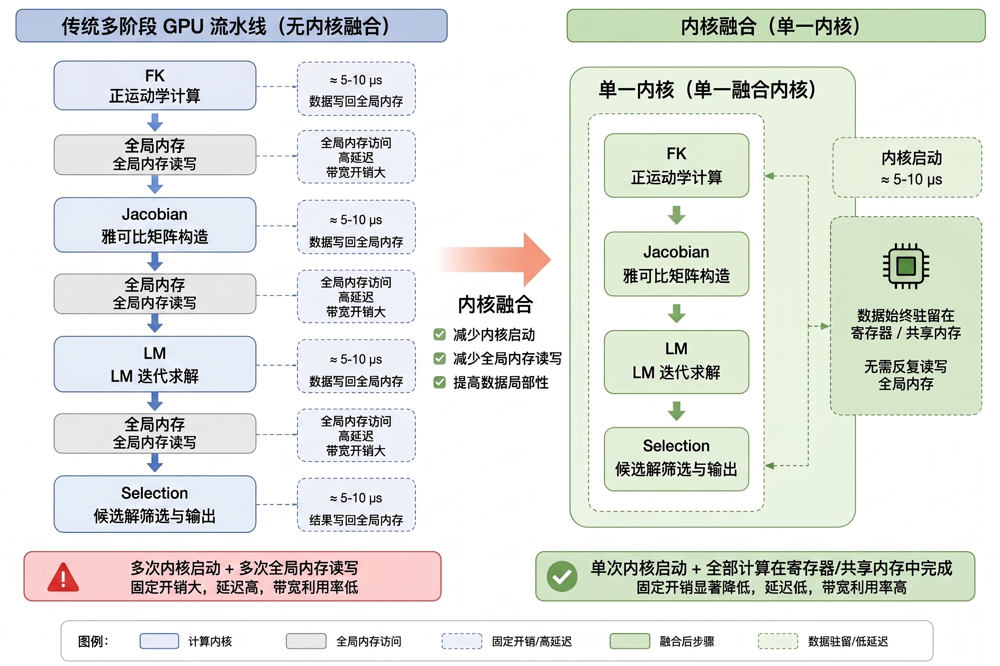
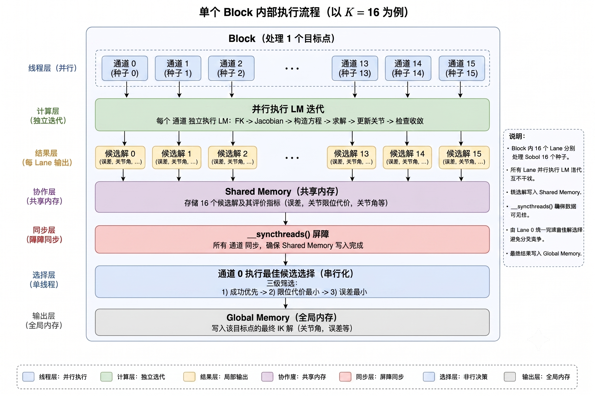
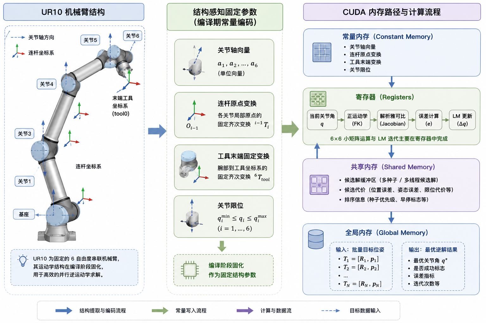
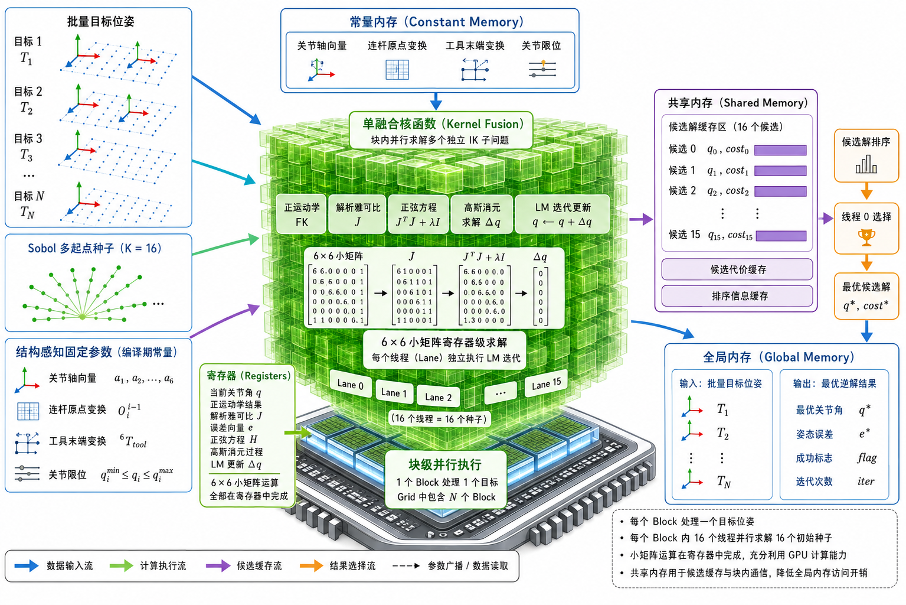
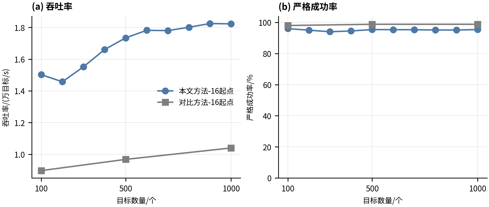
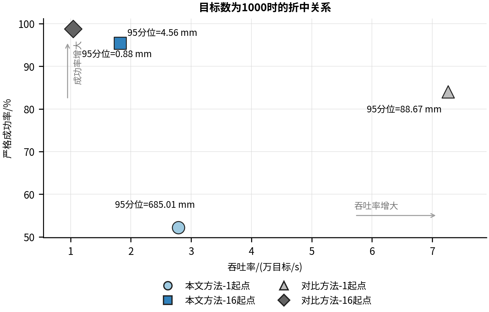
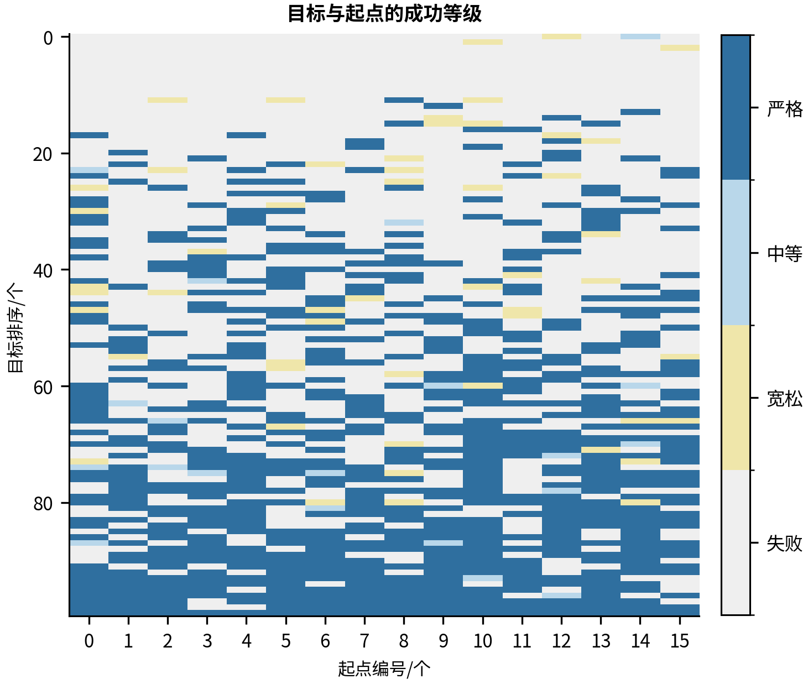
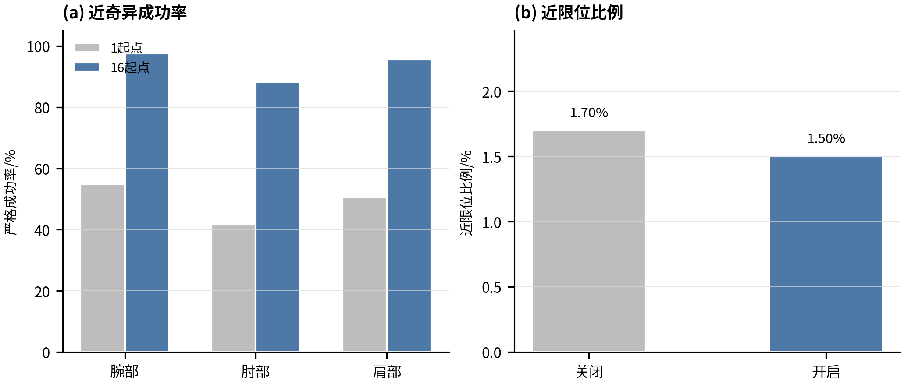
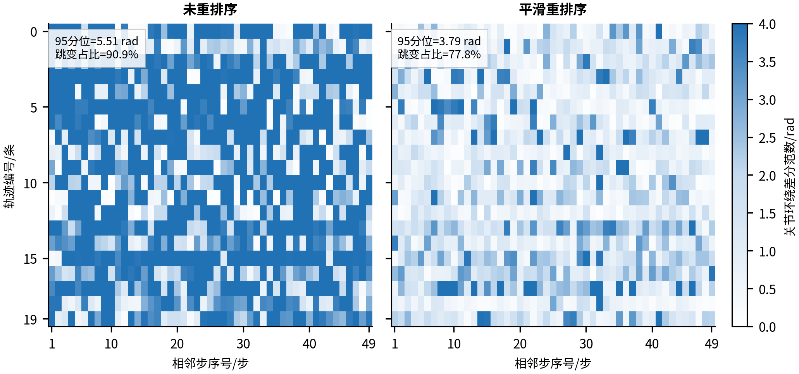

# 面向小矩阵批量逆运动学的 CUDA 单核函数融合求解

刘霄鹏

武汉科技大学 机械工程学院，武汉 430081

**文章编号：**（预留） **DOI：**（预留）

## 摘要

**摘　要：** 针对固定六自由度机械臂批量逆运动学中通用图形处理器（graphics processing unit，GPU）流水线调度开销与矩阵规模不匹配的问题，提出一种结构感知的统一计算设备架构（compute unified device architecture，CUDA）核函数融合求解方法。将运动学参数和解析雅可比构造编码为编译期常量，采用目标块映射将每个位姿分配至独立线程块，块内16线程分别承载Sobol低差异种子执行独立求解，在单一核函数内完成正运动学、雅可比组装、正规方程求解和候选筛选。实验结果表明，批量规模 $N\le1\,000$ 时，Strict 成功率为 0.940~0.960，GPU 流时间与 $N$ 严格线性相关（$R^2>0.999$），吞吐量达 $1.82\times10^4$~targets/s；同种子数条件下吞吐量为多阶段流水线的 1.75 倍，验证了小矩阵批量计算中硬件--算法协同设计思路的有效性。

**关键词：** 逆运动学；统一计算设备架构（CUDA）；小矩阵批量计算；核函数融合；并行计算

**中图分类号：** TP391.4 **文献标志码：** A

**收稿日期：**（预留）；**修回日期：**（预留）。

---

## Abstract

**Abstract:** Aiming at the structural mismatch between GPU scheduling overhead and tiny matrix size in batch inverse kinematics for fixed six-degree-of-freedom manipulators, a structure-aware CUDA kernel fusion method is proposed. Kinematic parameters and analytical Jacobian construction are encoded as compile-time constants. A target-block mapping assigns each pose to one thread block, where 16 threads carry independent Sobol low-discrepancy seeds, with forward kinematics, Jacobian assembly, normal equation solution and candidate selection fused in a single kernel. Experiments on an RTX 4060 Laptop GPU show that for batch size $N\le1\,000$, the Strict success rate is 0.940--0.960, GPU stream time scales linearly with $N$ ($R^2>0.999$), and throughput reaches $1.82\times10^4$~targets/s. With equal seeds, throughput is 1.75 times that of a multi-stage pipeline, validating the effectiveness of the hardware-algorithm co-design approach for tiny-matrix batch computation.

**Keywords:** inverse kinematics; compute unified device architecture (CUDA); tiny-matrix batch computation; kernel fusion; parallel computing

---

## 0 引言

机械臂批量逆运动学（inverse kinematics，IK）是采样式运动规划、轨迹优化和机器人学习中的核心计算环节[1-4]。近年来，向量化采样式规划进一步表明，正运动学、碰撞检测和局部 IK 等细粒度子程序的批量并行化对实时规划前端具有直接价值[5]。对 6 自由度串联机械臂而言，单个 IK 问题规模极小：$6\times6$ 雅可比矩阵、6 维线性系统、每迭代约 1 650 次双精度浮点运算。当批量规模 $N$ 达到数百至数千时，计算范式发生根本转变——问题从"单个 6 维非线性最小二乘"变为"$N$ 个独立 $6\times6$ 小矩阵运算的批量并行调度问题"。在这一范式下，GPU 的固定调度开销（核函数启动约 $5$--$10$ $\mu$s/次）和主机--设备同步延迟可能主导实际性能[6-7]，形成小矩阵批量计算的结构性矛盾：每个子问题计算量极小，不足以摊薄调度开销；但子问题数量足够多，可用并行性充足。

这一矛盾并非 IK 特有，而是广泛存在于机器人学中任何涉及固定小规模线性代数批量计算的场景。现有 GPU 库对小矩阵支持不足：NVIDIA cuBLAS 批量 GEMM 接口（cublasGemmBatchedEx）设计目标为 $m,n,k\ge16$，对 $6\times6$ 规模存在 $>10$ $\mu$s/次的固定调用开销；cuSOLVER 批量 LU/QR 分解存在类似问题[6]。小矩阵批处理领域已有研究表明，寄存器分块、共享内存常驻和批量调度策略对 tiny matrices 的性能影响显著[8]。传统迭代 IK 可追溯到 resolved-rate control、阻尼最小二乘和误差阻尼伪逆等方法[9-11]，这些方法在单目标场景中易于部署，但当目标数达到百级以上时，每目标毫秒级耗时难以满足实时规划前端需求。在 GPU 加速领域，cuRobo[12] 和 ManipulaPy[13] 采用 CUDA Graph、粒子群优化器和自定义 CUDA 核函数实现大规模并行 IK 和机器人操作加速，后续工作进一步从可变精度、混合采样优化和工业扩展自由度应用等角度推进 GPU 运动生成[14-16]。然而，通用多阶段优化结构在 $N\le1\,000$ 的中小批量场景中仍存在固定调度成本。

本研究提出一种面向六自由度机械臂批量逆运动学的结构感知 CUDA 核函数融合方法。其核心不是将已有算法库移植至 GPU，而是将运动学结构信息（关节轴方向、解析几何关系、固定 Sobol 种子数 $K=16$）作为编译期常量编码进核函数，使正运动学（forward kinematics，FK）、雅可比组装、迭代更新与块内候选筛选全部在单一核函数内完成，从根本上压缩小矩阵批量计算中调度开销与计算量之间的结构性矛盾。该研究在 NVIDIA GeForce RTX 4060 Laptop GPU 上对方法进行了系统实验验证和微架构分析。

该方法的应用场景界定为：批量目标数 $N\le1\,000$、机械臂构型固定为 6 自由度、碰撞检测不在逆运动学核函数内处理的实时规划前端。对于通用多阶段 GPU 流水线，小批量逆运动学中核函数启动、主机-设备同步和全局内存中转会显著影响端到端延迟；本文通过单核函数融合压缩上述固定调度成本。核函数融合之后，主要瓶颈转移为双精度小矩阵求解、三角函数和标量寄存器运算的指令延迟，该现象与小矩阵批量计算中浮点吞吐利用率偏低的普遍特征一致。

## 1 问题描述与评价指标

### 1.1 批量IK问题建模

令 $q\in\R^6$ 为 UR10 六个旋转关节角，正运动学 $T_{\mathrm{ee}}(q)\in\SE(3)$ 将关节角映射至末端 tool0 位姿。对目标 $T^\star$，定义平移误差 $e_p(q)=p_{\mathrm{ee}}(q)-p^\star\in\R^3$ 和旋转误差 $e_R(q)=\log(R^\star{}^\top R_{\mathrm{ee}}(q))^\vee\in\R^3$。单目标 IK：

$$
\min_{q\in[q_{\min},q_{\max}]}\frac{1}{2}\|e_p(q)\|^2+\frac{\alpha_R}{2}\|e_R(q)\|^2.
\tag{1}
$$

式中，$q\in\R^6$ 为关节角向量；$e_p$ 为平移误差；$e_R$ 为旋转误差；$\alpha_R$ 为旋转误差权重系数。

批量 IK 需对 $N$ 个独立目标并行求解式(1)，输出每目标的最佳候选解。6-DOF 串联机械臂在关节限位和奇异位形附近存在多解性和可解性退化问题[9]，多种子策略是应对该挑战的有效手段。

### 1.2 评价指标

- **Strict 成功率**：同时满足 $e_p<5$ mm 且 $e_R<1^\circ$ 的目标比例；
- **全样本位置误差 $p95$**：全部 $N$ 个目标（含失败）位置误差的 95 分位数；
- **原始吞吐量**：$N/\bar{t}_{\mathrm{gpu}}$，$\bar{t}_{\mathrm{gpu}}$ 为 CUDA event 测量的 GPU 流时间均值（30 次重复）。

## 2 单核函数融合方法

本章按自底向上的顺序展开：首先将运动学参数编码为 GPU 常量内存，然后设计融合正运动学函数实现解析雅可比的高效组装，接着给出迭代求解算法，最后将所有组件融合为单一目标块核函数。

### 2.1 运动学参数的编译期常量编码

UR10 运动学参数来源于官方 URDF 模型[17]。将以下编译期确定的信息编码为 CUDA `__constant__` 内存：

- 6 个关节轴单位向量 $a_i\in\R^3$（$a_0=Z,a_1=Y,a_2=Y,a_3=Y,a_4=-Z,a_5=Y$）；
- 6 个连杆偏移矩阵 $\mathrm{origin}_i\in\SE(3)$；
- 腕 3 至 tool0 固定变换 $T_{\mathrm{wrist3\_to\_tool0}}$；
- 关节限位 $[q_{i,\min},q_{i,\max}]$ 和障碍函数参数。

Ada Lovelace 架构（SM 8.9）提供 48 KB 常量缓存，所有线程块可通过广播总线低延迟访问。这些参数总计约 2 KB——不足缓存容量的 5%，可避免明显的常量缓存逐出。这一设计将运动学结构信息从运行时变量转化为编译期内联常量，是后续单核函数融合的基础。

### 2.2 融合正运动学与解析雅可比构造

数值差分雅可比需对每个关节执行正负扰动 FK，每迭代 $6\times2=12$ 次额外 FK 调用。对平均 20 次迭代，累计约 260 次 FK 调用——FK 成为计算瓶颈。本研究设计的融合 FK 函数在单次前向传播中同步输出三个层次的几何量：末端 tool0 位姿 $T_{\mathrm{ee}}$、各关节世界位置 $p_i$、各关节世界转轴 $z_i=R_{3\times3}^{(i)}\cdot a_i$。算法 1 给出了融合 FK 的计算流程。

**算法 1：融合 FK 函数（含坐标系输出）**

```c
// 输入：6维关节角向量
// 输出：末端tool0位姿、关节世界位置、关节转轴
Input:  q[0:5]
Output: T_ee, p[0:5][0:2], z[0:5][0:2]

// 初始化4x4齐次变换矩阵为单位阵
T ← I_4
for i = 0 to 5 do
    // 施加连杆偏移矩阵，记录关节世界位置
    T ← T · origin[i]
    p[i] ← [T_3, T_7, T_11]
    // 提取当前累积旋转子块，计算世界转轴向量
    R_3×3 ← T_{0:2,0:2}
    z[i] ← R_3×3 · axis[i]
    // 施加绕关节轴i的旋转
    T ← T · Rodrigues(axis[i], q[i])
// 施加腕3至tool0固定变换
T_ee ← T · T_wrist3_to_tool0
return T_ee, p, z
```

获得 $(p_i,z_i)$ 后，$6\times6$ 解析雅可比矩阵的组装仅需 6 次叉积运算[1,2]：

$$
J_{v,i}=z_i\times(p_{\mathrm{ee}}-p_i),\quad J_{\omega,i}=z_i,\quad i=0,\dots,5.
\tag{2}
$$

式中，$z_i$ 为第 $i$ 关节世界转轴向量；$p_{\mathrm{ee}}$ 为末端世界位置；$p_i$ 为第 $i$ 关节世界位置。

与有限差分方案相比，解析组装的优势体现在三个方面：（1）减少 FK 调用次数，以 6 次叉积替代 12 次扰动 FK；（2）避免差分步长调参；（3）在奇异附近或尺度不一致时提供更稳定的梯度方向。本文将解析雅可比定位为降低计算量和提高迭代方向稳定性的结构化实现，而非追求截断误差层面的精度提升。



*Fig. 1 Kernel fusion flow of the proposed method*

图 1 给出了本文方法的整体内核融合流程示意：结构常量编码于编译期，融合 FK 一次性输出末端位姿、关节位置和转轴，解析雅可比由叉积组装，随后输入迭代求解器，最终经块内选择输出最佳候选解。

### 2.3 迭代求解算法

每个 Sobol 种子独立执行最多 60 次迭代。加权误差 $e=[e_p^\top,\alpha_R e_R^\top]^\top\in\R^6$ 与雅可比 $J\in\R^{6\times6}$ 构造正规方程：

$$
(J^\top J+\lambda I)\Delta q=-(J^\top e+w_{\mathrm{limit}}\nabla\Phi_{\mathrm{limit}}),
\tag{3}
$$

式中，$J$ 为雅可比矩阵；$\lambda$ 为阻尼因子；$\Delta q$ 为关节角增量；$e$ 为加权误差向量；$w_{\mathrm{limit}}$ 为限位障碍权重；$\Phi_{\mathrm{limit}}=\sum_{j=0}^5\phi(q_j)$ 为关节限位二次障碍函数，其中 $\phi(q_j)=\max(0,m-(q_j-q_{j,\min}))^2+\max(0,m-(q_{j,\max}-q_j))^2$，安全裕度 $m=0.087$ rad（约 $5^\circ$），默认 $w_{\mathrm{limit}}=0.03$。阻尼因子自适应采用Levenberg-Marquardt方法的阻尼自适应策略[18-19]，并采用无回滚策略：若 $\rho>0$ 则 $\lambda\leftarrow0.5\lambda$，否则 $\lambda\leftarrow2\lambda$，$\lambda\in[10^{-6},0.5]$——新候选解总是被接受，以降低控制流复杂度和状态保存开销。$6\times6$ 正规方程的求解采用寄存器级高斯消元（Gaussian elimination with partial pivoting），所有中间变量保持在寄存器中，避免对小矩阵调用通用线性代数库的额外开销。

算法 2 给出了单个种子的完整迭代流程。

**算法 2：单种子迭代求解**

```c
// 输入：Sobol种子、目标位姿、最大迭代次数、初始阻尼
// 输出：最优关节角、代价、成功等级
Input:  q_seed, T_target, max_iter=60, λ_0=0.01
Output: q_best, cost_best, success_rank

// 初始化
q ← q_seed; λ ← λ_0; cost_best ← ∞
for iter = 1 to max_iter do
    // 调用算法1：融合FK输出末端位姿+关节位置+转轴
    (T_ee, p, z) ← FusedFK(q)
    e_p ← p_ee - p_target; e_R ← log(R^T R_ee)
    // 解析雅可比组装：6次叉积替换12次扰动FK
    for i = 0 to 5 do
        J_{0:2,i} ← z[i] × (p_ee - p[i])
        J_{3:5,i} ← z[i]
    // 正规方程 + 寄存器级6×6高斯消元
    H ← J^T J + λ I; g ← J^T e
    Δq ← GaussElim6×6(H, -g - w∇Φ)
    q_trial ← q + Δq; clamp to [q_min, q_max]
    // 损失评估：位姿代价+限位障碍
    cost ← 0.5‖e‖² + w_limit Φ(q_trial)
    ρ ← (cost_old - cost) / cost_old
    // 阻尼自适应：总是接受trial，仅调节λ
    if ρ > 0 then λ ← 0.5λ else λ ← 2λ
    q ← q_trial
    if cost < cost_best then (q_best, cost_best) ← (q, cost)
    // 收敛判定
    if converged(‖e_p‖<5mm, ‖e_R‖<1°) then break
return (q_best, cost_best, success_rank)
```

### 2.4 目标-线程块映射与单核函数融合

上述迭代对 $N$ 个目标 $\times$ $K$ 个种子独立执行，共 $N\times K$ 个独立求解任务。朴素逐目标实现的启动次数随 $N$ 和 $K$ 线性增长，多阶段批量流水线的启动次数随阶段数和迭代次数增长。本文将正运动学、雅可比、LM 更新和候选选择全部融合进单个目标块核函数，从根本上消除阶段间全局内存中转和主机-设备同步。



*Fig. 2 Execution flow and data flow within a single thread block*

图 2 展示了单个线程块内部的执行流程：通道0--15各加载一个低差异起点，分别执行迭代求解，将候选解写入共享内存，同步后由通道0进行三级层次化选择，最终将最佳候选写回全局内存。

**算法 3：Target-Block 融合核函数**

```c
// 核函数签名与启动配置
Kernel:  IK_LM_Multiseed_Block_Target
Grid:    N blocks, Block: 32 threads
Constants: T_targets[N], seeds[N][K][6] (global)
Shared:    s_cand[K][stride] (K=16, stride=16)
Output:    best[N][kBestStride]

// 每个Block处理一个目标；16个lane各执行一个Sobol种子
tid ← blockIdx.x; lane ← threadIdx.x
if lane < K then
    // 加载种子，调用算法2执行迭代
    q_seed ← seeds[tid][lane]
    (q_best, cost, rank) ← Solver_Iter(q_seed, T_targets[tid])
    // 候选解写入共享内存
    for j = 0 to 5 do s_cand[lane][j] ← q_best[j]
    s_cand[lane][6..8] ← 目标平移分量
    s_cand[lane][9] ← cost
    s_cand[lane][10] ← rank
    s_cand[lane][11] ← (near_limit ? 1 : 0)
    // 同步全部16 lane的候选解写入
    __syncthreads()
    // 仅lane 0执行块内三级层次化选择
    if lane = 0 then
        best_idx ← 0
        for k = 1 to K-1 do
            // 优先级1: success rank
            if s_cand[k][10] > s_cand[best_idx][10] then best_idx ← k
            else if equal then
                // 优先级2: near_limit (0优于1)
                if s_cand[k][11] < s_cand[best_idx][11] then best_idx ← k
                // 优先级3: pose cost升序
                else if equal ∧ s_cand[k][9] < s_cand[best_idx][9]
                    then best_idx ← k
        // 最佳候选从共享内存写回全局内存
        for j = 0 to 5 do best[tid][j] ← s_cand[best_idx][j]
        best[tid][6] ← s_cand[best_idx][9] (pose cost)
        best[tid][7] ← s_cand[best_idx][10] (success rank)
```

算法 3 的三个关键数据结构设计为：

**(1) Grid-Block 映射。** `<<<N,32>>>` 启动配置将 $N$ 个目标位姿一对一映射至 $N$ 个线程块，每块 32 线程中 lane 0--15 各承载一个 Sobol 种子（$K=16$），lane 16--31 空闲。每个目标的计算完全局部化于一个 SM 内——无跨块通信、无全局同步。该映射的核函数启动次数恒为 1，与 $N$ 和 $K$ 无关。

**(2) 共享内存候选缓存。** 候选解数组 `s_cand[16][16]` 仅用于块内 16 个候选解的暂存和选择，总容量约 2 KB，采用列步长布局避免 bank 冲突。候选写入和读取发生在每个 block 内，访问次数相对主循环较少；该设计遵循 CUDA 共享内存局部复用和减少全局内存往返的通用优化原则[20]。

**(3) 块内三级层次化选择。** 线程通道 0 扫描 16 个候选解的优先级：求解成功等级（Strict > Medium > Loose > Fail）→ 近限位标志位（0 优于 1）→ 位姿代价升序，在共享内存和寄存器中完成，不引入额外核函数启动。



*Fig. 3 GPU computing architecture and memory hierarchy*

图 3 展示了图形处理器计算层次以及常量内存、共享内存和全局内存的层次结构。运动学常量驻留在常量内存中供所有线程块广播访问；目标位姿和种子数据通过全局内存读入；候选解暂存于共享内存供块内选择。

### 2.5 核函数融合的调度开销分析

表 1 给出了不同实现路径的阶段开销对比。对于本文方法，核心求解阶段由单个 target-block kernel 完成，H2D、kernel、D2H 之外无中间 host-device 同步。该结构差异在 $N\le1\,000$ 的低批量场景中较为重要——kernel launch 固定开销被摊薄至不足总 GPU 流时间的 0.3%。

**表 1 核函数融合前后的调度开销对比**
*Table 1 Launch overhead comparison before and after kernel fusion*

| 实现方式 | 核函数阶段数 | 全局内存往返 | 主机同步次数 |
|:--------|:-----------:|:-----------:|:-----------:|
| 朴素逐目标实现 | $O(NK)$ | 多次 | 多次 |
| 多阶段批量流水线 | $O(\mathrm{stage}\times\mathrm{iter})$ | 多次 | 少量 |
| 本文方法 | 1 | 最少 | 无中间同步 |

## 3 实验设置与评价方法

所有实验在单块 NVIDIA GeForce RTX 4060 Laptop GPU 上进行（Ada Lovelace，SM 8.9，24 组 SM，8 GB GDDR6，FP64 理论峰值约 0.18 TFLOPS）。软件栈为 CUDA Toolkit 13.3（nvcc V13.3.33）、驱动 610.43.02、GCC 11.4.0，编译选项为 `-O3 -DCMAKE_BUILD_TYPE=Release`。求解器参数为 variant = opt4c_block_target、precision = fp64、limit_gradient = analytic、$K=16$（Sobol 序列[21]）、预热 10 次、重复测量 30 次。所有 GPU 时间由 CUDA event API 测量（cudaEventElapsedTime），排除首轮预热和内存分配时间。

目标位姿采用"随机关节角 → FK"策略生成，确保物理可达。固定随机种子 42，生成 $N=100,200,\dots,1\,000$（步长 100，共 10 个规模）的目标位姿 raw 文件（$[N,16]$ double，行优先 $4\times4$ 齐次矩阵）。cuRobo 对比采用 cuRobo-Graph 模式，碰撞检测关闭，CUDA Graph 开启，并分别报告默认单种子配置（cuRobo-Graph-K1）和同等 16 种子配置（cuRobo-Graph-K16）。cuRobo 的 graph capture、solver 构造和内存分配不计入单次 GPU solve 时间；预热与重复测量阶段计入 CUDA Graph replay 后的求解时间。所有方法输出的关节角均经同一 UR10 URDF 外部 FK 管线复评。本文以 Strict 作为主指标，并用 Loose、Medium 和 Ultra 作为辅助阈值：Loose 为 30 mm / $10^\circ$，Medium 为 10 mm / $5^\circ$，Strict 为 5 mm / $1^\circ$，Ultra 为 2 mm / $0.5^\circ$；四级阈值均基于复评误差计算。

## 4 实验结果

### 4.1 静态可达目标的批量求解性能

表 2 给出 10 个规模的综合结果。全部规模通过单调性检查（Loose SR ≥ Medium SR ≥ Strict SR），零 NaN/Inf 异常。Strict 成功率 0.940～0.960，$N\ge500$ 时全样本位置误差 $p95$ 均低于 5 mm Strict 阈值。平均迭代 19～21 次，近限位比例 $<1.0\%$。

**表 2 静态批量逆运动学综合性能（$N=100\sim1\,000$，步长 100）**
*Table 2 Comprehensive performance of static batch IK ($N=100\sim1\,000$, step 100)*

| $N$ | GPU时间/ms | 吞吐量/(t·s$^{-1}$) | Strict SR | $p95$/mm | 迭代次数 | 近限位 |
|:--:|:---------:|:------------------:|:---------:|:--------:|:-------:|:-----:|
| 100 | 6.658 | 15 019.0 | 0.960 | 4.38 | 21.0 | 0.010 |
| 200 | 13.724 | 14 572.8 | 0.950 | 5.49 | 20.0 | 0.005 |
| 300 | 19.334 | 15 516.5 | 0.940 | 27.04 | 20.0 | 0.007 |
| 400 | 24.090 | 16 604.1 | 0.945 | 15.44 | 20.0 | 0.005 |
| 500 | 28.837 | 17 338.9 | 0.954 | 4.34 | 20.0 | 0.004 |
| 600 | 33.677 | 17 816.3 | 0.953 | 4.36 | 20.0 | 0.005 |
| 700 | 39.329 | 17 798.8 | 0.953 | 4.78 | 19.5 | 0.006 |
| 800 | 44.421 | 18 009.3 | 0.951 | 4.91 | 19.0 | 0.006 |
| 900 | 49.330 | 18 244.6 | 0.951 | 4.90 | 19.0 | 0.007 |
| 1 000 | 54.868 | 18 225.5 | 0.954 | 4.56 | 19.0 | 0.007 |

**吞吐量增长模式。** $N=100\to1\,000$ 吞吐量仅提升 21%（$1.50\to1.82\times10^4$），符合典型的固定开销分摊曲线——该趋势可由 Amdahl 定律刻画：lane 0 串行候选选择（约 0.005 ms/target）构成不可并行的串行分量。GPU 流时间与 $N$ 严格线性（$R^2>0.999$，斜率 0.054 9 ms/target），不随批量增大而退化——这是 target-block 映射结构确定性的直接验证。

**GPU 时间组成。** 核函数融合后，SAKF-IK 的总时间主要由核心求解 kernel 贡献。$N=1\,000$ 时 H2D、D2H 与 launch 合计约 150 $\mu$s，仅占总 GPU 流时间的 0.274%，说明调度开销已被压缩至可忽略水平。后续优化重点应转向降低单迭代 FP64 小矩阵求解、三角函数和标量寄存器运算的代价。



*Fig. 4 Solving flow and data flow of manipulator IK on CUDA architecture*

图 4 展示了机械臂 IK 问题在 CUDA 架构上的完整求解映射，从输入目标位姿到最终候选解输出的数据流与计算阶段。



*Fig. 5 Throughput vs. success rate comparison under equal seed count $K=16$*

图 5 给出了同种子数 $K=16$ 条件下的吞吐量与 Strict 成功率对比。cuRobo-Graph-K1 作为默认单种子配置仍保留在表 3 和图 6 中，用于说明吞吐优先配置与成功率优先配置的差异。

全样本位置误差 $p95$ 对比如下：本方法 $p95$ 在 $N\ge500$ 时低于或接近 5 mm Strict 阈值（4.34～4.91 mm）；cuRobo K=1 的 $p95$ 为 74～115 mm，被失败样本尾部影响而升高；cuRobo K=16 降至 0.5～0.9 mm。

### 4.2 与 cuRobo 的同种子数公平对比

表 3 给出了 $N=100,500,1\,000$ 下四种配置的系统级对比。该表同时列出全样本 $p95$、成功样本 $p95$ 和有效吞吐量，用于区分求解速度和满足 Strict 阈值的有效求解速度。

**默认配置对比。** $N=100$ 时本方法在吞吐量和精度上同时领先 cuRobo K=1（吞吐比 1.45:1，SR 0.960 vs 0.860）。$N\ge200$ 时 cuRobo K=1 凭借粒子群并行搜索反超，$N=1\,000$ 时吞吐达 $7.26\times10^4$ targets/s，但 Strict SR 仅 0.840，$p95$ 为 88.7 mm。

**同等 16 种子对比。** cuRobo 种子数提升至 $K=16$ 后，Strict SR 达 0.980～0.988，$p95$ 仅 0.5～0.9 mm。然而，本方法的吞吐量是 cuRobo K=16 的 1.67～1.79 倍（$N=1\,000$ 时 $1.82\times10^4$ vs $1.04\times10^4$ targets/s）。该吞吐优势来自单核函数融合减少阶段间全局内存中转和主机-设备同步——这正是小矩阵批量计算中结构性优化的直接收益。

**有效吞吐量分析。** 若仅以 $\text{throughput}\times\text{Strict SR}$ 衡量，cuRobo-Graph-K1 在 $N=1\,000$ 时仍具有更高有效吞吐；但该指标未反映失败目标在规划管线中的重采样、回退或轨迹修补代价。对于要求单次 batch 输出高比例 Strict 解、且不希望引入额外回退逻辑的规划前端，SAKF-IK-K16 的一次性成功率更具工程可控性。

**表 3 cuRobo-Graph 与本文方法的系统级对比（$N=100,500,1\,000$）**
*Table 3 System-level comparison between cuRobo-Graph and the proposed method ($N=100,500,1\,000$)*

| $N$ | 方法 | $K$ | Strict SR | 吞吐/$10^4$ | 全样本$p95$/mm | 成功$p95$/mm | 有效吞吐/$10^4$ |
|:--:|:----|:--:|:--------:|:----------:|:------------:|:----------:|:-------------:|
| 100 | 本文 | 16 | 0.960 | 1.502 | 4.38 | 3.17 | 1.442 |
| 100 | cu-Graph | 16 | 0.980 | 0.897 | 0.89 | 0.03 | 0.879 |
| 100 | 本文 | 1 | 0.450 | 1.535 | 642.23 | 4.31 | 0.691 |
| 100 | cu-Graph | 1 | 0.860 | 1.038 | 74.17 | 0.05 | 0.893 |
| 500 | 本文 | 16 | 0.954 | 1.734 | 4.34 | 2.10 | 1.654 |
| 500 | cu-Graph | 16 | 0.988 | 0.968 | 0.47 | 0.33 | 0.956 |
| 500 | 本文 | 1 | 0.502 | 2.572 | 686.16 | 4.77 | 1.291 |
| 500 | cu-Graph | 1 | 0.838 | 4.350 | 114.46 | 0.22 | 3.645 |
| 1 000 | 本文 | 16 | 0.954 | 1.823 | 4.56 | 2.55 | 1.739 |
| 1 000 | cu-Graph | 16 | 0.988 | 1.040 | 0.88 | 0.42 | 1.028 |
| 1 000 | 本文 | 1 | 0.522 | 2.786 | 685.01 | 4.61 | 1.454 |
| 1 000 | cu-Graph | 1 | 0.840 | 7.262 | 88.67 | 0.28 | 6.100 |

> 注：cu-Graph 表示 cuRobo-Graph；吞吐与有效吞吐单位均为 $10^4$ targets/s。



*Fig. 6 Three-way trade-off among throughput, success rate and error ($N=1\,000$)*

> 注：有效吞吐 = 吞吐量 × Strict SR，反映实际成功求解的目标速率。

进一步地，为避免单一 Strict 阈值掩盖质量差异，本文在 $N=1\,000$ 下对 Loose、Medium、Strict 和 Ultra 四级阈值进行扫描，结果如表 4 所示。cuRobo-Graph-K16 在 Ultra 阈值下仍保持 0.970 成功率；SAKF-IK-K16 在 Strict 和 Medium 阈值下均为 0.954，在 Loose 阈值下为 0.965，表明其定位是满足 5 mm/$1^\circ$ 附近的工程阈值。cuRobo-Graph-K1 的 Strict 成功率为 0.838，Loose 成功率升至 0.896；SAKF-IK-K1 在四级阈值下均明显低于 SAKF-IK-K16，验证多起点策略的必要性。

**表 4 不同误差阈值下的成功率扫描（$N=1\,000$）**
*Table 4 Success rate scan under different error thresholds ($N=1\,000$)*

| 方法 | Loose | Medium | Strict | Ultra |
|:----|:----:|:-----:|:-----:|:-----:|
| SAKF-IK-K16 | 0.965 | 0.954 | 0.954 | 0.851 |
| SAKF-IK-K1 | 0.568 | 0.540 | 0.522 | 0.249 |
| cuRobo-Graph-K16 | 0.998 | 0.997 | 0.988 | 0.970 |
| cuRobo-Graph-K1 | 0.896 | 0.857 | 0.838 | 0.825 |

### 4.3 CPU 基线对照

为避免 GPU 加速结论脱离 CPU 求解语境，本文补充单进程 Python/NumPy CPU 基线。该基线复用与 CUDA runner 相同的 UR10 结构常量、raw target、Sobol seed 和最大迭代次数。结果如表 5 所示，CPU-K16 在 $N=1\,000$ 时 Strict SR 同为 0.954，但吞吐仅 6.74 targets/s；GPU 对应吞吐为 $1.72\times10^4$～$1.82\times10^4$ targets/s——加速比超过 2 700 倍，说明当批量规模达到百级以上时，target-block 并行结构能够显著摊薄固定调度和迭代开销。

**表 5 Python/NumPy CPU 基线对照**
*Table 5 Python/NumPy CPU baseline comparison*

| 方法 | $N$ | Strict SR | 吞吐/(t·s$^{-1}$) | $p95$/mm |
|:----|:--:|:--------:|:----------------:|:--------:|
| CPU-K1 | 100 | 0.450 | 94.20 | 642.2 |
| CPU-K16 | 100 | 0.960 | 6.33 | 4.38 |
| CPU-K1 | 500 | 0.502 | 102.97 | 686.2 |
| CPU-K16 | 500 | 0.954 | 6.66 | 4.34 |
| CPU-K1 | 1 000 | 0.522 | 106.78 | 685.0 |
| CPU-K16 | 1 000 | 0.954 | 6.74 | 4.56 |

### 4.4 多起点策略消融

为定量分离 Sobol 多起点策略对方法性能的贡献，将种子数从 $K=16$ 降至 $K=1$，保持其他全部参数不变。如表 6 所示，$K=16$ 时 Strict SR 稳定在 0.95 以上，$K=1$ 时骤降至 0.45～0.52——降低约 43～51 个百分点。$K=1$ 的 $p95$ 误差为 642～685 mm（$K=16$ 时为 4.3～4.6 mm），表明单种子时大量求解陷入不可接受的局部极小值。

**表 6 种子数消融实验：$K=16$ vs $K=1$**
*Table 6 Seed count ablation experiment: $K=16$ vs $K=1$*

| $N$ | $K16$ SR | $K1$ SR | $K16$ $p95$/mm | $K1$ $p95$/mm |
|:--:|:-------:|:-------:|:-------------:|:-------------:|
| 100 | 0.960 | 0.450 | 4.38 | 642.2 |
| 500 | 0.954 | 0.502 | 4.34 | 686.2 |
| 1 000 | 0.954 | 0.522 | 4.56 | 685.0 |

进一步扫描 $K=1,2,4,8,16$ 的结果显示，随着 $K$ 增大，Strict 成功率从 $K=1$ 的 0.522 提升至 $K=16$ 的 0.954，吞吐量从约 $2.55\times10^4$ targets/s 降至约 $1.72\times10^4$ targets/s。$K=8$ 到 $K=16$ 仍带来 3.0 个百分点的成功率提升，并将 $p95$ 从 36.1 mm 降至 4.6 mm，因此本文选择 $K=16$ 作为默认配置。

为观察多起点候选在目标维度上的分布，图 7 绘制了 16 个 Sobol seed 的候选成功等级。部分目标仅少数 seed 达到 Strict，而另一些目标在多个 seed 上均可稳定收敛。这一现象解释了多起点策略的成功率提升来源：多起点并非简单增加重复计算，而是在不同 IK 分支和局部极小之间提供候选覆盖。



*Fig. 7 Heatmap of candidate success levels across targets and seeds*

消融结果揭示以下关键事实：

**(1) 成功率主要来源于多起点策略。** $K=16$ 时 Strict SR 稳定在 0.95 以上，$K=1$ 时骤降至 0.45～0.52。$K=16$ 时 $p95$ 为 4.3～4.6 mm，$K=1$ 时扩大至 642～685 mm，表明 16 个 Sobol 低差异起点有效减少了大误差失败。

**(2) 速度与成功率之间存在明确权衡。** $N=1\,000$ 时 $K=1$ 吞吐量为 $2.55\times10^4$ targets/s，$K=16$ 为 $1.72\times10^4$ targets/s；以约三分之一的吞吐代价，Strict SR 从 0.522 提升至 0.954。

**(3) 核函数启动次数与 $K$ 无关。** 无论 $K=16$ 还是 $K=1$，核心求解阶段均由单个 target-block kernel 完成，调度开销始终 $<0.01\%$ GPU 流时间——这是该方法区别于多阶段 GPU pipeline 的主要结构差异。

**(4) 与 cuRobo 的交叉对比确立范式边界。** 同等单种子条件下，cuRobo SR 为 0.830～0.880，该方法仅为 0.450～0.522。同等 16 种子条件下，cuRobo SR 达 0.988 但吞吐仅 $1.04\times10^4$，该方法以 0.954 SR 实现 $1.82\times10^4$ 吞吐（1.75 倍优势）。三方对比确立清晰的帕累托前沿：cuRobo K=16 位于高精度端，该方法 K=16 位于吞吐优先且满足 Strict 阈值的区域，cuRobo K=1 为吞吐优先且失败尾部较重。

### 4.5 近奇异与近限位场景分析

为检验随机可达目标之外的适用边界，构造 wrist、elbow、shoulder 三类近奇异目标和一类近限位目标，每类覆盖 $N=100,500,1\,000$。所有目标仍采用固定随机种子 42 并由 FK 生成，保持物理可达。

如图 8a 所示，SAKF-IK-K16 在 wrist 和 shoulder 类型下仍保持较高成功率；elbow singular 下 $N=1\,000$ 的 Strict SR 降至 0.883，说明固定阻尼迭代仍不能完全处理肘部奇异区域。

近限位实验比较关节限位正则 ON/OFF，结果如图 8b 所示。$N=1\,000$ 下 ON 与 OFF 的 Strict SR 分别为 0.940 和 0.943，表明当前 barrier 的主要作用是安全裕度约束而非收敛加速。关节限位权重扫描显示，提高 $w_{\mathrm{limit}}$ 不会单调提升 Strict SR，默认 $w_{\mathrm{limit}}=0.03$ 为保守折中。



*Fig. 8 Robustness boundary analysis for near-singular and near-limit scenarios*

### 4.6 连续轨迹上的分支跳变分析

本文构造 line_50、arc_50 和 random_local_50 三类轨迹，每类 20 条、每条 50 点。相邻点关节跳变量采用旋转关节环绕差分计算：$\Delta q=\mathrm{atan2}(\sin(q_t-q_{t-1}),\cos(q_t-q_{t-1}))$，取 6 维欧氏范数。原始 best 选择的 $p95(\Delta q)$ 为 5.44～5.61 rad，jump count 为 883～893。使用候选级离线 smoothness rerank 后，$p95(\Delta q)$ 降至 3.48～3.80 rad，jump count 降至 718～778，如图 9 所示。由于每类轨迹包含 $20\times49=980$ 个相邻间隔，smoothness rerank 后 jump ratio 仍约为 73.3\%～79.4\%，说明简单二次平滑重排序不能从根本上保证关节连续性。



*Fig. 9 Heatmap of joint displacement between consecutive trajectory waypoints*

### 4.7 最大迭代次数敏感性分析

$N=1\,000$ 下扫描最大迭代次数：$max\_iter=20$ 时 Strict SR 为 0.912，$p95$ 为 25.7 mm；增至 60 后 Strict SR 达 0.954，$p95$ 降至 4.6 mm。继续增至 80 或 100 仅带来 0.3～0.5 个百分点的增益，却近似线性增加计算时间，因此默认 $max\_iter=60$。

### 4.8 微架构瓶颈分析

**寄存器压力与占用率。** 表 7 列出不同寄存器限制下主核函数的统计。无限制时每线程 194 个寄存器，限制 160 时开始溢出（216 bytes spill stores），限制 128 时溢出显著增加。RTX 4060 Laptop GPU 每 SM 65 536 寄存器，理论占用率 $10.5/24\approx44\%$。

**表 7 不同寄存器限制下的 PTX 寄存器与溢出统计**
*Table 7 PTX register and spill statistics under different register limits*

| 限制 | 寄存器/线程 | 溢出存储/B | 溢出加载/B |
|:---:|:----------:|:----------:|:----------:|
| 无限制 | 194 | 0 | 0 |
| 160 | 160 | 216 | 212 |
| 128 | 128 | 568 | 740 |

44% 的中等占用率表明瓶颈不是全局内存带宽决定。长延迟依赖主要来自 $6\times6$ FP64 小矩阵求解、三角函数、寄存器相关依赖和标量控制流——这正是小矩阵 GPU 计算的典型特征。

**浮点吞吐利用率。** $N=1\,000$ 时，每目标约 20 次迭代 × 每迭代约 1 650 FLOP，总计 $3.3\times10^7$ FLOP 在 54.9 ms 内完成，实际 FP64 吞吐约 0.60 GFLOPS——仅为 RTX 4060 Laptop GPU 理论峰值的 0.33%。极低的浮点利用率源于大量标量寄存器操作、超越函数和控制流指令，也是小矩阵 GPU 计算的普遍特征。

**混合精度验证实验。** 将雅可比构造与 Hessian 累加迁移至 FP32（`mixed_safe` 模式），仅保留 $6\times6$ 高斯消元与收敛判定在 FP64。结果如表 8 所示：$N=1\,000$ 时吞吐仅提升 2%，说明性能限制并非来自雅可比和 Hessian 的浮点精度，而与寄存器级小矩阵求解、超越函数和控制流共同相关。

**表 8 混合精度消融实验（$N=1\,000$, $K=16$）**
*Table 8 Mixed precision ablation experiment ($N=1\,000$, $K=16$)*

| 配置 | Strict SR | 吞吐/(t·s$^{-1}$) | $p95$/mm |
|:----|:--------:|:---------------:|:--------:|
| FP64（基准） | 0.954 | 18 930 | 4.6 |
| mixed_safe（FP32 J/H） | 0.954 | 19 275 | 4.5 |

> 注：表 8 数据来自独立实验批次，FP64 基线（18 930 targets/s）与表 2（18 226 targets/s）存在约 4% 的批次间差异，仅表内对比有效。

**Nsight Compute 动态验证。** 使用 NVIDIA Nsight Compute[22] 对主核函数进行运行时采样，关键指标如表 9 所示。Warp Stall Long Scoreboard 占比 83.2%，Issue Slot Utilization 仅 2.32%，Memory Throughput 仅 3.71%——量化验证了计算密集型小矩阵求解的瓶颈特征。

**表 9 Nsight Compute 动态性能指标（$N=1\,000$, $K=16$）**
*Table 9 Nsight Compute dynamic performance metrics ($N=1\,000$, $K=16$)*

| 指标 | 实测值 | 含义 |
|:----|:-----:|:----|
| Warp Stall Long Scoreboard | 83.2% | 长延迟依赖占主导 |
| Issue Slot Utilization | 2.32% | 指令发射利用率低 |
| Compute (SM) Throughput | 84.2% | 活跃时计算密集 |
| Memory Throughput | 3.71% | 非访存瓶颈 |
| 共享内存 Bank 冲突 | 约 112k | 冲突率 $<0.1\%$ |

### 4.9 批量规模扩展性分析

批量扩展趋势已在图 5 和表 3 中给出。GPU 流时间严格线性（$R^2>0.999$），每目标固定开销约 0.055 ms，用户无需对不同批量规模进行预扫描或参数调优即可估计吞吐量。该结果说明 target-block 映射在 $N\le1\,000$ 范围内未出现性能退化。

## 5 讨论

### 5.1 设计范式：帕累托前沿上的定位

消融实验与公平对比共同确立了该方法在质量--吞吐量帕累托前沿上的位置。cuRobo K=16 位于高精度端（SR 0.988, $p95$ 0.9 mm），cuRobo K=1 位于吞吐优先端（$7.26\times10^4$ targets/s），该方法 K=16 位于两者之间：SR 0.954、$p95$ 4.6 mm、吞吐 $1.82\times10^4$ targets/s。该拐点定位的工程意义明确：在采样式运动规划的典型场景（$N\le1\,000$，单次查询需一次性高成功率），该方法提供了无需后处理、延迟确定的求解路径。

该方法的主要贡献由此明确为小矩阵批量计算中硬件--算法协同设计带来的结构差异，而非单一优化器的性能超越。

### 5.2 可推广性与加速方向

本文框架可推广到其他串联机械臂，但需要重新生成结构参数、解析雅可比计算路径、线程映射和寄存器资源配置。对于 7-DOF 冗余机械臂（如 Franka Panda[23]），解空间维度增加且零空间优化需求更强，不能直接认为 UR10 上的成功率和吞吐量可平移。两个后续方向更值得优先研究：（1）利用相邻目标或上一时刻解进行 seed warm-start，减少平均迭代次数并改善轨迹连续性；（2）引入奇异鲁棒阻尼或任务相关重排序，缓解 elbow singular 和 near-limit 目标中的失败尾部。

## 6 结论

针对固定 6 自由度中小批量逆运动学中单种子收敛概率不足与多阶段 GPU 流水线固定开销较高的问题，本文提出基于结构感知 CUDA 核函数融合的批量逆运动学方法。主要工作和结论如下：

（1）将 Sobol 多起点策略与核函数融合协同设计，$K=16$ 个 Sobol 种子、解析雅可比、迭代求解和块内候选选择融合于单个目标块核函数。$K$ 从 1 增至 16 时，严格成功率从 0.522 提升至 0.954，全样本位置误差 $p95$ 从 685.0 mm 降至 4.6 mm，且核函数启动次数恒为 1，与种子数无关。

（2）设计融合正运动学函数，单次前向传播同步输出末端位姿、关节世界位置和关节转轴，解析雅可比由 6 次叉积组装，每迭代正运动学调用从有限差分的多次扰动降至 1 次结构化评估。

（3）实现寄存器级 $6\times6$ 小矩阵高斯消元求解，所有中间变量保持在寄存器中，避免对小矩阵调用通用线性代数库的额外开销。

（4）与 cuRobo 进行同等种子数公平对比，确立帕累托前沿定位：同等 16 种子条件下，cuRobo 严格成功率 0.988 位于高精度端，本文方法严格成功率 0.954 满足工程阈值且吞吐量为其 1.75 倍；三方对比明确本文方法在质量--吞吐量帕累托前沿上的拐点位置，即满足严格成功率阈值前提下的吞吐优先方案。

（5）在近奇异与近限位场景下验证了方法的适用边界：腕部和肩部奇异下仍保持较高成功率，肘部奇异下严格成功率降至 0.883；限位正则主要作为安全裕度约束而非收敛加速手段。轨迹实验表明，候选级平滑重排序可降低相邻点关节跳变，但轨迹连续性仍需进一步研究。

综上，在 $N\le1\,000$、固定 6 自由度、无碰撞约束的条件下，本文方法提供了一种成功率优先、执行路径确定的逆运动学 GPU 求解方案，其优势来源于 Sobol 多起点与单核函数融合的协同设计。后续研究方向包括：引入相邻目标解的热启动策略以降低轨迹跳变；设计奇异鲁棒阻尼改善肘部奇异区域的成功率；在 7 自由度冗余机械臂上评估框架的可推广性。

---

## 参考文献

[1] SICILIANO B, SCIAVICCO L, VILLANI L, et al. Robotics: modelling, planning and control[M]. 3rd ed. London: Springer, 2010.
[2] LYNCH K M, PARK F C. Modern robotics: mechanics, planning, and control[M]. Cambridge: Cambridge University Press, 2017.
[3] LAVALLE S M. Planning algorithms[M]. Cambridge: Cambridge University Press, 2006.
[4] SUCAN I A, MOLL M, KAVRAKI L E. The Open Motion Planning Library[J]. IEEE Robotics & Automation Magazine, 2012, 19(4): 72-82.
[5] THOMASON W, KINGSTON Z, KAVRAKI L E. Motions in microseconds via vectorized sampling-based planning[C]//Proc. of the 2024 IEEE International Conference on Robotics and Automation (ICRA). IEEE, 2024: 8749-8756.
[6] NVIDIA. CUDA C++ programming guide[EB/OL]. [2026-07-06]. https://docs.nvidia.com/cuda/cuda-c-programming-guide/.
[7] DU A, ADABAG E, BRAVO G, et al. GATO: GPU-accelerated and batched trajectory optimization for scalable edge model predictive control[EB/OL]. arXiv: 2510.07625, 2025.
[8] YANG S L, WANG J, WANG Y S. Matrix-free 3D SIMP topology optimization with fused gather–GEMM–scatter kernels[EB/OL]. arXiv: 2604.18020, 2025.
[9] DOMRACHEV I, NEDELCHEV S. mjinx: differentiable GPU-accelerated inverse kinematics in JAX[EB/OL]. 2025. https://github.com/based-robotics/mjinx.
[10] PERRAULT N, HO Q H, LAHIJANIAN M. Kino-PAX: highly parallel kinodynamic sampling-based planner[J]. IEEE Robotics and Automation Letters, 2025, 10(3): 2430-2437.
[11] CHEN Z Y, ZHAO Y Q, CHEN S T, et al. BODex: scalable and efficient robotic dexterous grasp synthesis using bilevel optimization[EB/OL]. arXiv: 2412.16490, 2024.
[12] SUNDARALINGAM B, HARIHARAN S K S, FISHMAN A, et al. cuRobo: parallelized collision-free robot motion generation[EB/OL]. arXiv: 2310.17274, 2023.
[13] ABOELNASR M I M. ManipulaPy: a GPU-accelerated Python framework for robotic manipulation, perception, and control[J]. Journal of Open Source Software, 2025, 10(114): 8490.
[14] HSIAO Y S, HARI S K S, SUNDARALINGAM B, et al. VaPr: variable-precision tensors to accelerate robot motion planning[C]//Proc. of the 2023 IEEE/RSJ International Conference on Intelligent Robots and Systems (IROS). IEEE, 2023.
[15] YASUTAKE C, KINGSTON Z, PLANCHER B. HJCD-IK: GPU-accelerated inverse kinematics through batched hybrid Jacobian coordinate descent[EB/OL]. arXiv: 2510.07514, 2025.
[16] ABUELSAMEN L, RANA H, LU H W, et al. Industrial robot motion planning with GPUs: integration of cuRobo for extended DOF systems[EB/OL]. arXiv: 2508.04146, 2025.
[17] Universal Robots. Universal Robots ROS2 description[EB/OL]. [2026-07-06]. https://github.com/UniversalRobots/Universal_Robots_ROS2_Description.
[18] LEVENBERG K. A method for the solution of certain non-linear problems in least squares[J]. Quarterly of Applied Mathematics, 1944, 2(2): 164-168.
[19] MARQUARDT D W. An algorithm for least-squares estimation of nonlinear parameters[J]. Journal of the Society for Industrial and Applied Mathematics, 1963, 11(2): 431-441.
[20] NVIDIA. CUDA C++ best practices guide[EB/OL]. [2026-07-06]. https://docs.nvidia.com/cuda/cuda-c-best-practices-guide/.
[21] SOBOL I M. On the distribution of points in a cube and the approximate evaluation of integrals[J]. USSR Computational Mathematics and Mathematical Physics, 1967, 7(4): 86-112.
[22] NVIDIA. Nsight Compute user guide[EB/OL]. [2026-07-06]. https://docs.nvidia.com/nsight-compute/.
[23] CHITTA S, SUCAN I, COUSINS S. MoveIt![J]. IEEE Robotics & Automation Magazine, 2012, 19(1): 18-19.

---

## 作者简介

刘霄鹏（2005--），男，本科，主要研究方向为机器人运动学、GPU 并行计算。
E-mail：182625516@qq.com
