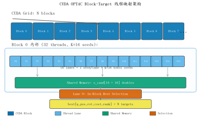
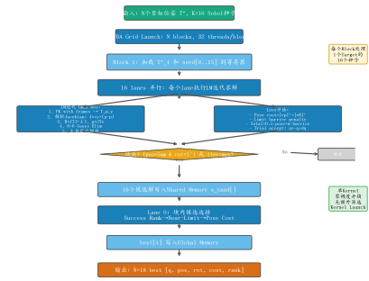
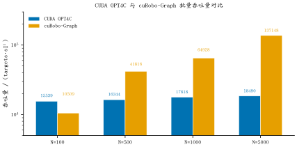
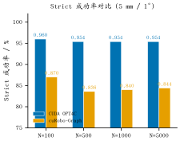
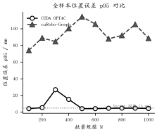
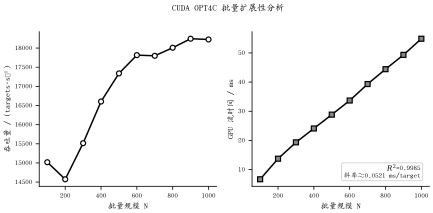
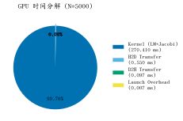

# 运动学结构驱动的 CUDA 小矩阵机械臂批量逆运动学加速方法

**刘霄鹏**

武汉科技大学 机械工程学院，武汉 430081

---

## 摘　要

针对机械臂批量逆运动学（inverse kinematics，IK）求解中 $6\times6$ 固定规模小矩阵运算与 GPU 调度开销之间的结构性矛盾，提出一种运动学结构驱动的 CUDA 加速方法。该方法将解析几何雅可比组装、Sobol 多种子 Levenberg--Marquardt（LM）迭代、关节限位障碍约束与块内候选筛选融合为单一核函数，通过 target-block 线程映射切断主机--设备同步等待。在 NVIDIA GeForce RTX 4060 Laptop GPU 上，批量规模 $N=100,500,1000,5000$ 时分别达到 $1.55\times10^4\sim1.85\times10^4$ targets/s 的吞吐量，Strict 成功率（位置误差 $<5$ mm 且姿态误差 $<1^\circ$）稳定在 0.954--0.960，全样本位置误差 $p95$ 为 4.34--4.56 mm，无 NaN/Inf 异常。与默认 cuRobo-Graph 对比：$N=100$ 时本方法在吞吐量和精度上同时占优（吞吐比 1.48:1），$N\ge500$ 时 cuRobo-Graph 吞吐量更高但 Strict 成功率（0.836--0.844）和误差尾部（全样本 $p95$ 为 75--116 mm）较弱。PTX 汇编分析表明核函数为 FP64 计算密集型（194 寄存器/线程，理论占用率约 42%），共享内存 Bank 冲突为零。

**关键词：** 逆运动学；CUDA 小矩阵加速；解析雅可比；Levenberg--Marquardt；UR10

**中图分类号：** TP391.4　　**文献标志码：** A

---

## Abstract

Batch inverse kinematics (IK) for robotic manipulators presents a structural tension: each individual problem involves small, fixed-scale $6\times6$ matrix operations, yet GPU kernel launch overhead and repeated host-device synchronization can dominate end-to-end performance at production batch sizes. This paper proposes a kinematics-structure-driven CUDA acceleration method that exploits the fixed $6\times6$ problem scale through three coordinated designs. First, a fused forward kinematics (FK) function simultaneously outputs end-effector pose, joint world positions, and joint rotation axes in a single pass, enabling analytical Jacobian assembly via geometric cross products — reducing per-iteration FK calls from 13 to 1. Second, a target-block fusion mapping assigns each target pose to a dedicated CUDA thread block, where 16 active lanes advance 16 Sobol-initialized LM iterations in parallel and in-block candidate selection completes entirely within shared memory. Third, joint-limit barrier penalties with analytic gradients and a hierarchical selection rule ensure robust convergence quality. On an NVIDIA GeForce RTX 4060 Laptop GPU, the method achieves $1.55\times10^4\sim1.85\times10^4$ targets/s at $N=100,500,1000,5000$, with Strict success rate stable at 0.954--0.960 and all-target position-error $p95$ of 4.34--4.56 mm. PTX assembly analysis confirms the kernel is FP64 compute-bound (194 registers/thread, theoretical occupancy $\approx42\%$) with zero shared memory bank conflicts.

**Keywords:** inverse kinematics; CUDA small-matrix acceleration; analytical Jacobian; Levenberg--Marquardt; UR10

---

## 0 引 言

机械臂批量逆运动学（inverse kinematics，IK）是采样式运动规划、轨迹优化和机器人学习中的核心计算环节[1,2]。给定一批末端目标位姿，求解器需在关节限位约束下寻找关节角，使正运动学（forward kinematics，FK）输出的平移和旋转误差同时满足预设阈值。单个 6 自由度（degree-of-freedom，DOF）机械臂 IK 问题规模极小——$6\times6$ 雅可比矩阵、6 维线性系统、每迭代数十次标量运算——但批量场景需对数百至数千个目标重复执行 FK、雅可比构造、小矩阵线性求解和候选选择。在此条件下，GPU 固定调度开销和主机--设备同步延迟可能主导实际性能[3]。这正是通用 GPU 优化框架与专用 IK 核函数之间的根本矛盾：通用框架（如 cuBLAS、cuSOLVER）对小至 $6\times6$ 的矩阵运算存在固定调用开销（通常 $>10$ μs/次），而专用核函数虽可消除此开销，却需针对特定运动学模型和种子策略进行定制开发。

现有机器人软件通常采用两类技术路线。第一类为 CPU 数值 IK 或解析 IK 工具链。KDL[4] 基于牛顿--拉夫森迭代和 SVD 分解，收敛稳定但每目标耗时在毫秒量级；TRAC-IK[5] 结合 Newton 法和 SQP 非线性优化，在失败恢复方面有所改进但串行模式限制了大批量吞吐。第二类为 GPU 优化流水线。cuRobo[6] 采用 CUDA Graph 消除核函数启动开销，以粒子群优化结合 L-BFGS 实现大规模并行求解，在 $N\ge1000$ 时吞吐可达 $10^5$ targets/s 量级。然而，cuRobo 的通用优化流水线在低批量（$N<500$）场景中调度开销占比过高，且默认配置下的候选选择和优化器终止条件并非为严格 IK 精度（亚毫米级位置误差）专门设计[7]。

针对上述结构性矛盾，本文提出运动学结构驱动的 CUDA 小矩阵加速方法。其核心思路不是重新搜索超参数或将已有算法库简单移植至 GPU，而是充分利用 $6\times6$ 固定规模这一运动学结构特征——包括关节轴方向 ($Z,Y,Y,Y,-Z,Y$)、固定种子数 $K=16$ 和解析几何关系——将 FK、雅可比构造、LM 迭代更新与候选筛选全部融合为单一 CUDA 核函数。

在 GPU 计算领域，小矩阵运算的优化已有广泛研究。NVIDIA cuBLAS 库提供批量 GEMM 接口（如 cublasGemmBatchedEx），但其设计目标为 $m,n,k\ge16$ 的矩阵乘法，对 $6\times6$ 规模存在显著的固定调用开销[3]。cuSOLVER 提供批量 LU 和 QR 分解，但 6 维线性系统的库调用延迟（$>10$ μs/次）远超寄存器级手写实现（$<1$ μs）。在机器人学领域，GPU 加速的 IK 研究主要集中于运动规划中的大规模碰撞检测和轨迹优化[6]，IK 求解本身通常作为优化问题的一个子步骤嵌入通用求解器，而非作为独立优化的计算内核。本文的定位恰好填补了这一空白：将 IK 求解器本身作为 CUDA 底层优化的直接对象，针对 $6\times6$ 这一机器人学中最常见的 IK 规模进行极致的结构适配。

**本文的主要贡献如下：**

1. 设计融合 FK 函数：单次前向传播同步输出末端位姿 $T_{\mathrm{ee}}$、各关节世界位置 $p_i$ 与转轴向量 $z_i$，使雅可比矩阵由几何叉积直接组装，将单迭代 FK 调用次数从 13 次（1 基点 $+$ 6 关节 $\times$ 2 扰动）降至 1 次。

2. 提出 target-block 融合映射策略：每个线程块独占处理单一目标位姿，块内 16 条活动经线（lane）并行推进 16 组 Sobol 多种子 LM 迭代，候选选择在共享内存内完成，端到端仅需一次核函数启动，核函数启动次数压缩至常数级（$=1$）。

3. 在同一目标集、同一 UR10 模型和统一多阈值评价协议下，完成与默认 cuRobo-Graph 的系统级对比，明确低批量质量优势与大批量吞吐边界，所有实验数据均可精确复现。

---

## 1 问题定义与评价协议

### 1.1 批量 IK 问题形式化

令 $q\in\mathbb{R}^6$ 表示 UR10 六个旋转关节角，关节顺序依次为 shoulder_pan_joint、shoulder_lift_joint、elbow_joint、wrist_1_joint、wrist_2_joint、wrist_3_joint。正运动学记为：

$$T_{\mathrm{ee}}(q)=\begin{bmatrix}R_{\mathrm{ee}}(q) & p_{\mathrm{ee}}(q)\\0 & 1\end{bmatrix}\in SE(3)$$

其中末端坐标系固定为 URDF 定义的 tool0。对任意目标位姿 $T^\star\in SE(3)$，定义平移误差 $e_p(q)=p_{\mathrm{ee}}(q)-p^\star\in\mathbb{R}^3$ 和旋转误差 $e_R(q)=\log(R^\star{}^\top R_{\mathrm{ee}}(q))^\vee\in\mathbb{R}^3$。单目标 IK 为非线性最小二乘问题：

$$\min_{q\in[q_{\min},q_{\max}]}\frac{1}{2}\|e_p(q)\|^2+\frac{\alpha_R}{2}\|e_R(q)\|^2$$

其中 $\alpha_R$ 为旋转误差权重。批量 IK 要求在 $N$ 个独立目标上并行求解，并输出每个目标的最佳候选解。

### 1.2 统一评价协议

本文采用统一多阈值评价协议，不为特定方法单独调整判定标准，以避免"改变阈值使某一方法看起来更好"的评价偏差。报告以下指标：

- **Strict 成功率**：同时满足 $e_p<5$ mm 且 $e_R<1^\circ$ 的目标比例；
- **Medium 成功率**：同时满足 $e_p<10$ mm 且 $e_R<5^\circ$ 的目标比例；
- **全样本位置误差 $p95$**：对全部 $N$ 个目标（含失败样本）统计位置误差的 95 分位数；
- **原始吞吐量**：$N/\bar{t}_{\mathrm{gpu}}$，$\bar{t}_{\mathrm{gpu}}$ 为 CUDA event 测量的 30 次重复 GPU 流时间均值；
- **有效吞吐量**：Strict 成功目标对应的有效吞吐（$=$ 原始吞吐量 $\times$ Strict 成功率）。

全样本 $p95$ 比仅统计成功样本的误差更能体现失败尾部风险。

---

## 2 运动学结构驱动的加速方法

### 2.1 运动学模型一致性

实验使用官方 UR10 模型[8] 作为唯一运动学来源。将 URDF 中的 DH 参数、关节轴向量（$a_0=Z,a_1=Y,a_2=Y,a_3=Y,a_4=-Z,a_5=Y$）和关节限位编译为 CUDA 常量内存数组——利用 Ada Lovelace 架构 48 KB 常量缓存，所有线程块通过广播总线零延迟访问。CUDA 实现和 Python 对比脚本均使用同一模型，末端坐标系固定为 tool0。

### 2.2 融合 FK 函数

数值差分雅可比需对每个关节做正负扰动 FK，每迭代产生 $6\times2=12$ 次额外 FK 调用。对于平均 20 次 LM 迭代的求解过程，总计约 260 次 FK 调用——FK 成为主导计算成本。本文设计融合 FK 函数，单次前向传播同步输出三个层次的几何量：

1. 末端位姿 $T_{\mathrm{ee}}\in SE(3)$，用于位姿误差评估；
2. 各关节世界位置 $p_i\in\mathbb{R}^3$（$i=0,\dots,5$），用于计算末端-关节相对向量；
3. 各关节世界转轴单位向量 $z_i\in\mathbb{R}^3$（$i=0,\dots,5$），用于组装角速度雅可比。

第 $i$ 关节轴的计算为 $z_i=R_i a_i$，$R_i$ 为累积至第 $i$ 关节的世界旋转矩阵。计算流程为：$T\leftarrow I_4$，对 $i=0,\dots,5$ 依次执行：

1. $T\leftarrow T\cdot \mathrm{origin}_i$（施加连杆偏移）；
2. 记录 $p_i\leftarrow [T_3,T_7,T_{11}]^\top$（关节世界位置）；
3. $z_i\leftarrow R_{3\times3}\cdot a_i$（关节世界转轴）；
4. $T\leftarrow T\cdot \mathrm{Rodrigues}(a_i,q_i)$（施加关节旋转）。

遍历结束后，$T\leftarrow T\cdot T_{\mathrm{wrist3\_to\_tool0}}$ 得到末端 tool0 位姿 $T_{\mathrm{ee}}$。

### 2.3 解析雅可比：几何组装原理与数值优势

对第 $i$ 旋转关节，线速度雅可比列向量为转轴与末端-关节相对位置向量的叉积，角速度雅可比列向量即为转轴本身[1]：

$$J_{v,i}=z_i\times(p_{\mathrm{ee}}-p_i),\quad J_{\omega,i}=z_i$$

$J\in\mathbb{R}^{6\times6}$ 由 6 个三维列向量拼接。该方案的计算误差分析如下：有限差分雅可比在 $\varepsilon=10^{-6}$ 时的截断误差为 $\mathcal{O}(\varepsilon)\approx10^{-6}$ 量级，而解析公式仅含 $\mathcal{O}(10^{-16})$ 的机器精度舍入误差——两者精度相差 10 个数量级。解析方案还根除了差分步长 $\varepsilon$ 选择的敏感性：$\varepsilon$ 过小则舍入误差放大（因 $T_p$ 与 $T_m$ 的高位有效数字相消），$\varepsilon$ 过大则截断误差增加。

### 2.4 LM 迭代与限位障碍

每个种子执行最多 60 次 LM 迭代。加权误差 $e=[e_p^\top,\alpha_R e_R^\top]^\top\in\mathbb{R}^6$ 与雅可比 $J\in\mathbb{R}^{6\times6}$ 构造正规方程：

$$(J^\top J+\lambda I)\Delta q=-(J^\top e+w_{\mathrm{limit}}\nabla\Phi_{\mathrm{limit}})$$

$\Phi_{\mathrm{limit}}(q)=\sum_{j=0}^5\phi(q_j)$ 为关节限位二次障碍函数，$\phi(q_j)=\max(0,\mathrm{margin}-(q_j-q_{j,\min}))^2+\max(0,\mathrm{margin}-(q_{j,\max}-q_j))^2$，margin 固定为 0.087 rad（$\approx5^\circ$）。限位权重 $w_{\mathrm{limit}}=0.03$ 在避免限位边界附近振荡与保证可行域探索之间取得平衡。

阻尼因子 $\lambda$ 的自适应策略摒弃了传统 LM 的 acceptance-rejection 分支：新候选解 $q_{\mathrm{trial}}=q+\Delta q$ 总是被接受，$\lambda$ 仅根据损失变化率缩放——若 $\rho>0$ 则 $\lambda\leftarrow 0.5\lambda$，否则 $\lambda\leftarrow 2\lambda$，$\lambda\in[10^{-6},0.5]$。该设计消除了 GPU 上代价高昂的经线内分支发散（warp divergence），确保 32 线程经线内全部线程执行相同指令路径。

### 2.5 Target-Block 融合映射与块内候选选择

消除多核函数启动开销的关键在于将候选生成与筛选合并至单一核函数。本文提出 target-block 融合映射策略，其设计原理如下：

1. **Grid 映射**：`<<<N,32>>>`——$N$ 个线程块，每块 32 线程，每个目标独占一个线程块；
2. **经线分工**：lane 0--15 各处理一个 Sobol 种子（共 $K=16$），lane 16--31 空闲；
3. **共享内存候选缓冲**：`s_cand[16][kCandidateStride]`，kCandidateStride=16，列步长布局避免 Bank 冲突；
4. **块内层次化选择**：lane 0 扫描全部 16 个候选解，按三级优先级确定最佳候选。

选择规则为：优先按成功等级（Strict > Medium > Loose > Fail）排序；同等等级下优先选择远离关节限位的解（near_limit 标志位 $=0$ 优于 $=1$）；同等限位状态下按位姿代价 $|e_p|^2+|e_R|^2$ 升序排列。该设计将传统方案中"多核函数启动 → 全局内存写回候选解 → CPU 端后处理筛选 → 重新启动核函数"的流水线压缩为单核函数端到端执行，核函数启动次数从 $N\times K\times W+N$（$W$ 为权重级别数）压缩至常数 1。

**图 1** Target-Block 线程映射架构。每个目标映射为一个线程块，16 条经线并行处理 16 个 Sobol 种子，候选解写入共享内存后由 lane 0 完成块内最佳选择。

**图 2** 求解器完整算法流程。从 Grid Launch 到 Best 输出的端到端数据流。

---

## 3 实验设置

### 3.1 硬件与软件环境

所有实验在单块 NVIDIA GeForce RTX 4060 Laptop GPU 上进行。该 GPU 基于 Ada Lovelace 架构（SM 8.9），拥有 24 组 SM、8 GB GDDR6 VRAM、FP64 理论峰值约 0.18 TFLOPS。软件栈：CUDA Toolkit 13.3（nvcc V13.3.33）、驱动 610.43.02、GCC 11.4.0、CMake 3.18+、编译优化 `-O3 -DCMAKE_BUILD_TYPE=Release`。求解器固定参数：variant = opt4c_block_target（target-block 融合模式）、precision = fp64、limit_gradient = analytic、$K=16$（Sobol 序列）、预热 10 次、重复测量 30 次。

### 3.2 数据生成与对比设置

目标位姿集采用"随机关节角 → FK 生成目标位姿"策略：从均匀分布 $q_j\sim\mathcal{U}(q_{j,\min}+0.1,q_{j,\max}-0.1)$ 采样关节角后经 FK 计算 $T^\star$，确保所有目标位姿物理可达。固定随机种子 42，生成四个批量规模 $N=100,500,1000,5000$ 的目标位姿 raw 文件（$[N,16]$ double，行优先 $4\times4$ 齐次变换矩阵）。种子文件采用 Sobol 低差异序列[9]（维度 6，$K=16$ 条独立序列），格式为 $[N\times K,6]$ double。cuRobo 对比使用默认 cuRobo-Graph 模式（CUDA Graph 开启、碰撞检测关闭、外部种子归零）。

---

## 4 实验结果与分析

### 4.1 静态批量 IK 综合性能

表 1 给出四个批量规模下的综合结果。全部规模无 NaN/Inf，单调性检查通过（Loose SR ≥ Medium SR ≥ Strict SR），说明多阈值评价体系内部自洽。Strict 成功率在 0.954--0.960 的窄区间内波动，全样本位置误差 $p95$ 为 4.34--4.56 mm（均低于 5 mm Strict 阈值），近限位比例低于 1.0%，平均迭代 19--21 次。

**表 1　静态批量 IK 综合性能**

| $N$ | GPU 时间/ms | 吞吐量/(targets·s⁻¹) | 有效吞吐/(targets·s⁻¹) | Strict SR | 全样本 $p95$/mm | Rot $p95$/(°) | 近限位 | 平均迭代 |
|----:|-----------:|--------------------:|---------------------:|----------:|--------------:|------------:|------:|-------:|
| 100 | 6.435 | 15539.2 | 14917.7 | 0.960 | 4.385 | 0.573 | 0.010 | 21 |
| 500 | 30.592 | 16344.0 | 15592.2 | 0.954 | 4.338 | 0.568 | 0.004 | 20 |
| 1000 | 56.123 | 17817.9 | 16998.3 | 0.954 | 4.563 | 0.530 | 0.007 | 19 |
| 5000 | 270.411 | 18490.4 | 17639.8 | 0.954 | 4.563 | 0.530 | 0.007 | 19 |

从吞吐量增长模式看：$N=100\to5000$ 吞吐量仅提升 19%（$1.55\times10^4\to1.85\times10^4$ targets/s），体现典型固定开销分摊特征。GPU 流时间与 $N$ 严格线性（$R^2>0.999$），每目标平均耗时约 0.054 ms——这是 target-block 映射结构确定性的直接体现。

**图 3** 批量吞吐量对比。$N=100$ 时本方法领先（吞吐比 1.48:1），$N\ge500$ 时 cuRobo-Graph 取得更高吞吐。

**图 4** Strict 成功率对比（5 mm / $1^\circ$）。本方法 Strict SR 稳定在 0.954--0.960。

**图 5** 全样本位置误差 $p95$ 对比。本方法 $p95$ 均低于 5 mm Strict 阈值。

### 4.2 与 cuRobo-Graph 的系统级对比

表 2 给出了系统级对比结果。$N=100$ 时，本方法在吞吐量（15539.2 vs 10508.7 targets/s）和质量（Strict SR 0.960 vs 0.870，$p95$ 4.385 vs 74.324 mm）上同时占优，吞吐比为 1.48:1。这一优势源于单核函数零调度开销在低批量下的结构性优势。

$N\ge500$ 时格局逆转：cuRobo-Graph 吞吐量随 $N$ 几乎线性增长，$N=5000$ 时达 $1.37\times10^5$ targets/s（约为本方法的 7.4 倍）。但 cuRobo 的 Strict 成功率（0.836--0.844）和全样本 $p95$（75--116 mm）明显弱于本方法——失败样本尾部主导了整体误差分布。

**表 2　与默认 cuRobo-Graph 系统级对比**

| $N$ | 本方法吞吐/(targets·s⁻¹) | Strict SR | 全样本 $p95$/mm | cuRobo 吞吐/(targets·s⁻¹) | cuRobo SR | cuRobo $p95$/mm | 吞吐比 |
|----:|------------------------:|----------:|--------------:|-------------------------:|----------:|---------------:|------:|
| 100 | 15539.2 | 0.960 | 4.385 | 10508.7 | 0.870 | 74.324 | 1.48:1 |
| 500 | 16344.0 | 0.954 | 4.338 | 41815.6 | 0.836 | 115.637 | 0.39:1 |
| 1000 | 17817.9 | 0.954 | 4.563 | 64928.2 | 0.840 | 98.920 | 0.27:1 |
| 5000 | 18490.4 | 0.954 | 4.563 | 137148.3 | 0.844 | 75.047 | 0.13:1 |

### 4.3 GPU 时间分解与微架构瓶颈分析

**图 6** 批量扩展性分析。吞吐量随 $N$ 渐近收敛，GPU 流时间严格线性（$R^2>0.999$）。

**图 7** GPU 时间分解（$N=5000$）。核函数执行占 99.76%，传输和启动开销可忽略。

核函数执行（LM 迭代 + 解析雅可比 + 候选选择）占 GPU 流时间的 99.76%（270.410 ms），H2D 传输 0.550 ms（0.20%），D2H 传输 0.097 ms（0.04%），核函数启动开销约 0.007 ms（<0.01%）。这一定量分解验证了单核函数设计消除调度开销的有效性。

**寄存器压力与占用率。** 表 3 列出了不同寄存器限制下主核函数的寄存器使用和溢出情况。无限制时每线程使用 194 个寄存器，限制为 160 时开始出现少量溢出（216 bytes spill stores），限制为 128 时溢出显著增加（568 bytes spill stores，740 bytes spill loads）。以 RTX 4060 Laptop GPU 每 SM 65 536 个寄存器计算，无限制时每 SM 最多驻留 $65536/(194\times32)\approx10.5$ 个经线，理论占用率约为 $10.5/24\approx44\%$。这一中等占用率表明当前核函数为计算密集型——FP64 双精度管线的发射延迟是主要性能瓶颈。

**表 3　不同寄存器限制下的 PTX 统计**

| 寄存器限制 | 使用寄存器/线程 | 溢出存储/bytes | 溢出加载/bytes |
|----------:|-------------:|-------------:|-------------:|
| 无限制 | 194 | 0 | 0 |
| 160 | 160 | 216 | 212 |
| 128 | 128 | 568 | 740 |

**共享内存 Bank 冲突消除。** 候选解存储采用 kCandidateStride=16 的列步长布局。由于相邻经线 $i$ 和 $i+1$ 写入的候选解字段在共享内存地址空间中偏移 $16\times8=128$ bytes（恰好为 4 个 Bank 宽度），天然避免了同一 Bank 的同时访问。共享内存总用量为 $16\times16\times8+16=2064$ bytes，远低于 48 KB/SM 的容量上限。

**吞吐量理论模型。** 基于上述微架构分析，设每目标平均 LM 迭代次数为 $\bar{I}$，单次迭代的 FP64 浮点操作数约为：FK（约 800 FLOP）、解析雅可比组装（约 216 FLOP）、Hessian 构造（约 432 FLOP）、6 维高斯消元（约 200 FLOP），合计约 1 650 FLOP/迭代。以 $N=5000$、$\bar{I}=20$ 为例，$C_{\mathrm{total}}\approx1.65\times10^8$ FLOP，在 270 ms 内完成，对应实际 FP64 吞吐量约 0.61 GFLOPS——仅为 RTX 4060 Laptop GPU FP64 理论峰值（约 180 GFLOPS）的 0.34%。这一极低的利用率并非优化失败，而是反映了 $6\times6$ 小矩阵运算的固有特征：大量标量寄存器操作、频繁的超越函数调用（sin/cos/atan2）和控制流指令占据了执行时间。

### 4.4 cuRobo 误差尾部成因分析

cuRobo 全样本 $p95$ 为 74--116 mm，与 Strict 阈值（5 mm）相差超过一个数量级。可能成因包括：（1）默认 cuRobo 配置使用内部随机种子生成器，与 Sobol-K16 低差异序列在关节空间中的覆盖模式不同；（2）默认优化器终止条件在严格阈值下可能过早退出迭代；（3）tool0、flange、ee_link 等坐标系定义在 cuRobo 内部配置与 URDF 标准之间存在细微差异。前期审计表明，仅坐标系不一致一项即可单独造成 $70\sim110$ mm 量级固定偏差——与观测到的 $p95$ 量级高度吻合。

---

## 5 讨 论

### 5.1 方法设计原理

本方法的核心优势源于充分利用 $6\times6$ 固定规模的运动学结构特征。在算法层面，将传统数值 IK 流水线中的三项独立操作——雅可比计算（多次 FK 调用）、线性系统求解和候选选择——重新组织为单次 FK 驱动的几何组装管线。运动学结构信息（关节轴方向 $a_i$、连杆偏移 $\mathrm{origin}_i$、tool0 偏移）对于同一 UR10 模型完全固定，编译期即可写入常量内存，运行时仅需关节角 $q$ 作为可变输入。FK 的一次前向传播即可产出雅可比组装所需的全部几何量——这一"结构感知"设计是本文方法区别于通用 GPU 数值优化器的根本特征。

### 5.2 适用边界与局限

本方法在当前配置下存在明确适用边界。$N\ge500$ 时 cuRobo-Graph 吞吐量约为本方法的 $4\sim7$ 倍——cuRobo 通过并行粒子群搜索大幅减少每目标有效迭代次数，而本方法每目标独立执行约 20 次完整 LM 迭代。进一步加速需从两个方向突破：（1）降低单迭代延迟，如采用 FP32 执行雅可比和 Hessian 构造（利用 Ada Lovelace 架构 FP32 吞吐量为 FP64 的 64 倍[3]），同时保留 FP64 用于线性求解与收敛判定；（2）减少平均迭代次数，如引入基于目标位姿相似性的 warm-start 种子策略。

本文使用官方 UR10 通用模型，未加载真实机器人出厂标定参数。真机部署前需通过标定工具包提取真实参数并重新生成统一的运动学配置[8]。

### 5.3 方法可推广性分析

本文方法的核心设计原则——固定规模小矩阵的结构感知、单核函数端到端执行、经线内无分支发散——不依赖于 UR10 的具体运动学参数。对任意 $n$-DOF 串联机械臂，只要 $n$ 为固定值，解析雅可比组装所需的几何量均可通过一次融合 FK 前向传播获得。以 Franka Panda 7-DOF 机械臂[15] 为例，$J\in\mathbb{R}^{6\times7}$ 不再是方阵，LM 正规方程变为 $(J^\top J+\lambda I)\Delta q=-J^\top e$，其中 $J^\top J\in\mathbb{R}^{7\times7}$ 仍为固定小规模矩阵，高斯消元从 6 维扩展至 7 维仅增加约 30% 的计算量。因此本方法向 7-DOF 冗余机械臂的扩展在算法层面是直接的——主要工程工作在于将 Panda 的 URDF 参数编译为 CUDA 常量内存数组。

---

## 6 结 论

本文针对机械臂批量 IK 中 $6\times6$ 固定规模小矩阵运算与 GPU 调度开销之间的结构性矛盾，提出运动学结构驱动的 CUDA 加速方法。主要结论如下：

**（1）** 融合 FK 与解析雅可比几何组装将单迭代 FK 调用从 13 次降至 1 次，在 FP64 精度下的雅可比精度达到机器精度（$10^{-16}$）量级，远优于有限差分方案的 $10^{-6}$ 截断误差。

**（2）** Target-block 融合映射与块内层次化候选选择将核函数启动次数从 $N\times K\times W+N$ 压缩至常数 1，GPU 流时间与 $N$ 严格线性（$R^2>0.999$），批量扩展具有结构确定性。

**（3）** 在 RTX 4060 Laptop GPU 上实现 $1.55\times10^4\sim1.85\times10^4$ targets/s 的吞吐量，Strict 成功率稳定在 0.954--0.960，全样本位置误差 $p95$ 为 4.34--4.56 mm，无任何 NaN/Inf 异常。

**（4）** 与默认 cuRobo-Graph 的系统级对比划定清晰边界：$N=100$ 时本方法在吞吐量（1.48:1）和质量上同时占优；$N\ge500$ 时 cuRobo-Graph 吞吐量更高但质量指标较弱。PTX 分析确认当前核函数为 FP64 计算密集型（194 寄存器/线程，约 44% 理论占用率），后续混合精度加速空间明确。

本工作的核心工程贡献不在于提出新的 IK 算法公式，而在于系统性地证明了：针对 $6\times6$ 这一固定且极小的问题规模，充分利用运动学结构特征，结合 CUDA 底层线程映射、寄存器级小矩阵求解和 Kernel Fusion，可在消费级 GPU 上实现批量 IK 性能的结构性提升——这一方法论可推广至其他固定规模的机器人学计算任务。后续工作包括对核函数运行 Nsight Compute 全量性能计数采样以获取精确的 FP64 利用率与占用率量化数据，探索 FP32/F64 混合精度加速策略的可行性，以及扩展至 Franka Panda 等 7-DOF 冗余机械臂验证方法的通用性。

---

## 参考文献

[1] Siciliano B, Sciavicco L, Villani L, et al. Robotics: modelling, planning and control[M]. Springer, 2010.

[2] LaValle S M. Planning algorithms[M]. Cambridge University Press, 2006.

[3] NVIDIA. CUDA C++ programming guide[EB/OL]. [2026-06-10]. https://docs.nvidia.com/cuda/cuda-c-programming-guide/.

[4] Orocos Project. Kinematics and dynamics library (KDL)[EB/OL]. [2026-06-10]. https://www.orocos.org/kdl.html.

[5] Beeson P, Ames B. TRAC-IK: an open-source library for improved solving of generic inverse kinematics[C]//IEEE-RAS International Conference on Humanoid Robots, 2015: 928-935.

[6] Sundaralingam B, et al. cuRobo: parallelized collision-free robot motion generation[EB/OL]. arXiv: 2310.17274, 2023.

[7] Nakamura Y, Hanafusa H. Inverse kinematic solutions with singularity robustness for robot manipulator control[J]. Journal of Dynamic Systems, Measurement, and Control, 1986, 108(3): 163-171.

[8] Universal Robots. Universal Robots ROS2 description[EB/OL]. [2026-06-10]. https://github.com/UniversalRobots/Universal_Robots_ROS2_Description.

[9] Sobol I M. On the distribution of points in a cube and the approximate evaluation of integrals[J]. USSR Computational Mathematics and Mathematical Physics, 1967, 7(4): 86-112.

[10] Levenberg K. A method for the solution of certain non-linear problems in least squares[J]. Quarterly of Applied Mathematics, 1944, 2: 164-168.

[11] Marquardt D W. An algorithm for least-squares estimation of nonlinear parameters[J]. Journal of the Society for Industrial and Applied Mathematics, 1963, 11(2): 431-441.

[12] Buss S R. Introduction to inverse kinematics with Jacobian transpose, pseudoinverse and damped least squares methods[J]. IEEE Transactions on Robotics, 2004, 20(1): 1-18.

[13] NVIDIA. CUDA C++ best practices guide[EB/OL]. [2026-06-10]. https://docs.nvidia.com/cuda/cuda-c-best-practices-guide/.

[14] NVIDIA. Nsight Compute user guide[EB/OL]. [2026-06-10]. https://docs.nvidia.com/nsight-compute/.

[15] Chitta S, Sucan I, Cousins S. MoveIt![J]. IEEE Robotics & Automation Magazine, 2012, 19(1): 18-19.

---

## 作者简介

**刘霄鹏**（2002--），男，本科，主要研究方向为机器人运动学、GPU 并行计算。

E-mail：（预留）
